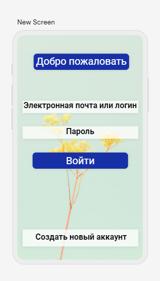
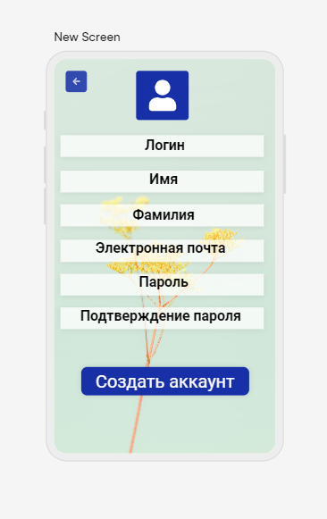
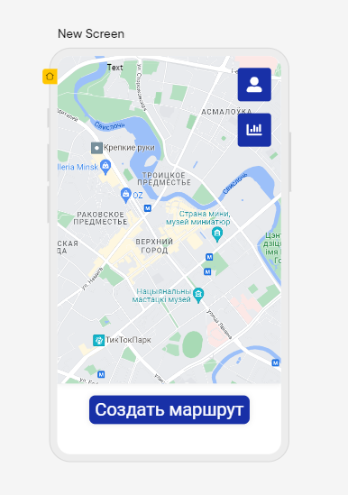
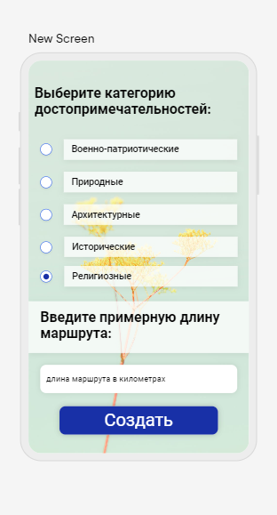
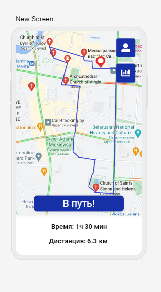
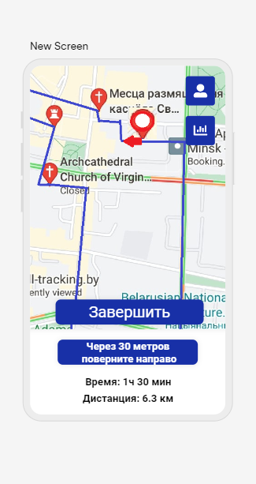
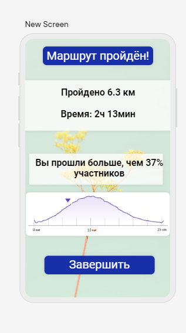
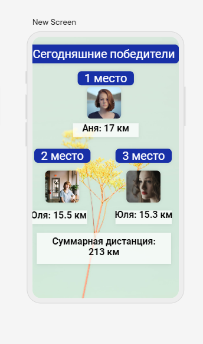
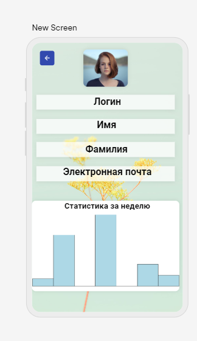

# Требования к проекту
---

# Содержание
1 [Введение](#intro)  
1.1 [Назначение](#appointment)  
1.2 [Бизнес-требования](#business_requirements)  
1.2.1 [Исходные данные](#initial_data)  
1.2.2 [Возможности бизнеса](#business_opportunities)  
1.2.3 [Границы проекта](#project_boundary)  
1.3 [Аналоги](#analogues)  
2 [Требования пользователя](#user_requirements)  
2.1 [Программные интерфейсы](#software_interfaces)  
2.2 [Интерфейс пользователя](#user_interface)  
2.3 [Характеристики пользователей](#user_specifications)  
2.3.1 [Классы пользователей](#user_classes)  
2.3.2 [Аудитория приложения](#application_audience)  
2.3.2.1 [Целевая аудитория](#target_audience)  
2.3.2.1 [Побочная аудитория](#collateral_audience)  
2.4 [Предположения и зависимости](#assumptions_and_dependencies)  
3 [Системные требования](#system_requirements)  
3.1 [Функциональные требования](#functional_requirements)  
3.1.1 [Основные функции](#main_functions)  
3.1.1.1 [Вход пользователя в приложение](#user_logon_to_the_application)  
3.1.1.2 [Определение месторасположения и выбор дальнейшего действия](#locate_user)  
3.1.1.3 [Просмотр и редактирование профиля активного пользователя](#view_and_update_user)  
3.1.1.4 [Выбор данных для создания маршрута](#choose_information_about_trip)  
3.1.1.5 [Просмотр составленного маршрута](#preview_trip)  
3.1.1.6 [Навигация при прохождении маршрута](#navigate_user_during_trip)  
3.1.1.7 [Завершение маршрута](#finish_trip)  
3.1.1.8 [Статистика других игроков](#statistics_of_other_users)  
3.1.1.9 [Выход зарегистрированного пользователя из учётной записи](#active_user_change)

3.1.2 [Ограничения и исключения](#restrictions_and_exclusions)  
3.2 [Нефункциональные требования](#non-functional_requirements)  
3.2.1 [Атрибуты качества](#quality_attributes)  
3.2.1.1 [Требования к удобству использования](#requirements_for_ease_of_use)  
3.2.1.2 [Требования к безопасности](#security_requirements)  
3.2.2 [Внешние интерфейсы](#external_interfaces)  
3.2.3 [Ограничения](#restrictions)  

<a name="intro"/>

# 1 Введение

<a name="appointment"/>

## 1.1 Назначение
Документа разработан для однозначной трактовки требований между разработчиком и заказчиком.  Необходимо разработать мобильное приложение с простым функционалом и актуальной и проверенной информацией о маршрутах.
В этом документе описаны функциональные и нефункциональные требования к мобильному приложению «SightWalk» для Android, IOS. Этот документ предназначен для команды, которая будет реализовывать и проверять корректность работы приложения. 

<a name="business_requirements"/>

## 1.2 Бизнес-требования

<a name="initial_data"/>

### 1.2.1 Исходные данные
В наше время здоровый и активный образ жизни набирает всё большую популярность. Однако для многих людей мотивацией к движению является какое-либо соревнование. Так люди молодой и средней возрастной категорий используют различные приложения для подсчёта шагов, которые сравнивают количество пройденных шагов с шагами, пройденными их друзьями или незнакомыми людьми. Но несмотря на то, что ежедневно люди всех возрастных категорий выходят на прогулки на свежем воздухе, иногда знакомые дороги приедаются и возникает вопрос «куда же сходить?». Ведь в повседневной жизни все люди день изо дня идут по одним и тем же маршрутам, что может являться одной из причин отсутствия желания выходить на прогулки. Из-за такого образа жизни многие люди даже не знают часть достопримечательностей своего родного города. Туристы, путешествующие самостоятельно, также часто задаются вопросом, куда пойти в новом городе.  

<a name="business_opportunities"/>

### 1.2.2 Возможности бизнеса
Многие молодые люди и люди средней возрастной категории желают иметь приложение, которое позволит не только производить подсчёт пройденных километров, но и составлять маршрут для пешеходных прогулок исходя из выбора категории достопримечательностей. Подобное приложение позволит им тратить меньше времени на поиск необходимой информации о различных достопримечательностях и продумывание маршрута, а соревнование по пройденным километрам добавит мотивацию и интерес к здоровому образу жизни. Интерфейс, спроектированный с учётом всех требований, и постоянное обновление информации о маршрутах позволят увеличить количество людей, использующих данное приложение.

<a name="project_boundary"/>

### 1.2.3 Границы проекта
Приложение «SightWalk» предоставит зарегистрированным пользователям выбор категории достопримечательностей, построит пешеходный маршрут в обе стороны согласно запросам пользователей, предоставит навигацию в пути, а также статистику о завершенной прогулке и о пользователе в целом. Приложение также позволит пользователям соревноваться между собой по количеству пройденных километров.

<a name="analogues"/>

## 1.3 Аналоги
На данный момент полностью аналогичного приложения не существует. Аналогичными с точки зрения соревнования по пройденным шагам являются следующие приложения: «Шаги ВКонтакте», «Samsung Health – вкладка Together». 
Со стороны достопримечательностей и составления маршрутов существует множество приложений, подобных «MAPS.ME», которые помогают найти необходимые места и проложить маршрут к ним.
 С точки зрения построения маршрута всей прогулки существует мобильное приложение «Открывая Москву», в котором пользователь выбирает категорию интересных мест и получает пешеходный маршрут по достопримечательностям Москвы, относящимся к выбранной категории. 
Наиболее близким аналогом является мобильное приложение «RunGo», которое предлагает пользователям интересные и проверенные маршруты для пробежек, а также позволяет отслеживать расстояние, затраченные калории и другие параметры тренировки.  

<a name="user_requirements"/>

# 2 Требования пользователя

<a name="software_interfaces"/>

## 2.1 Программные интерфейсы
Продукт должен являться мобильным приложением и иметь user-friendly интерфейс. 

<a name="user_interface"/>

## 2.2 Интерфейс пользователя
Окно входа в приложение.  

Окно регистрации нового пользователя.  
  

Главное окно приложения.  
  

Окно выбора категории достопримечательностей и примерной длины маршрута 
  

Окно отображения построенного маршрута  
  

Окно навигации при прогулке  
  

Окно завершения прогулки  
  

Окно статистики участников  
  

Окно статистики и данных активного пользователя.  

<a name="user_specifications"/>

## 2.3 Характеристики пользователей

<a name="user_classes"/>

### 2.3.1 Классы пользователей

| Класс пользователей | Описание |
|:---|:---|
| Зарегистрированные пользователи | Пользователи, которые вошли в приложение под своим именем (псевдонимом), желающие составить маршрут и принять участие в соревновании по количеству пройденных километров. Имеют доступ к полному функционалу |

<a name="application_audience"/>

### 2.3.2 Аудитория приложения

<a name="target_audience"/>

#### 2.3.2.1 Целевая аудитория
Люди молодой и средней категории со средним или выше среднего уровнем образования, обладающие минимальной технической грамотностью.

<a name="collateral_audience"/>

#### 2.3.2.2 Побочная аудитория
Люди старшей возрастной категории, обладающие вышеперечисленными качествами.

<a name="assumptions_and_dependencies"/>

## 2.4 Предположения и зависимости
1. Приложение не работает при отсутствии подключения к Интернету и включенной геолокации.

<a name="system_requirements"/>

# 3 Системные требования

<a name="functional_requirements"/>

## 3.1 Функциональные требования

<a name="main_functions"/>

### 3.1.1 Основные функции

<a name="user_logon_to_the_application"/>

#### 3.1.1.1 Вход пользователя в приложение
**Описание.** Пользователь имеет возможность использовать приложение войдя в свою учётную запись или создав новую.

| Функция | Требования | 
|:---|:---|
| <a name="registration_requirements"/>Регистрация нового пользователя | Приложение должно запросить у пользователя ввести логин, имя, фамилию, электронную почту и пароль для создания учётной записи. Пароль вводится дважды для подтверждения |
| *Пользователь с таким логином существует* | *Приложение должно известить пользователя об ошибке регистрации и запросить ввод логина. Пользователь должен либо ввести логин, либо отменить действие* |
| Вход зарегистрированного пользователя в приложение | Приложение должно запросить у пользователя ввести логин или электронную почту, а также пароль|

<a name="locate_user"/>

#### 3.1.1.2 Определение месторасположения и выбор дальнейшего действия
**Описание.** После входа пользователя в приложение необходимо отобразить пользователю его месторасположение и предоставить пользователю выбор дальнейшего действия. 
**Требование.** Приложение должно определить и отобразить на карте месторасположение пользователя. Пользователь должен иметь возможность выбора одного из следующих действий: просмотр и редактирование профиля активного пользователя, просмотр статистики других игроков, создание маршрута.

<a name="view_and_update_user"/>

#### 3.1.1.3 Просмотр и редактирование профиля активного пользователя
**Описание.** Зарегистрированный пользователь имеет возможность посмотреть и отредактировать данные о себе.

**Требование.** Приложение должно отобразить пользователю и предоставить возможность редактирования следующих данных: фотография, логин, имя, фамилия и электронная почта. Также в профиле пользователь может увидеть статистику по его прогулкам за неделю. Приложение также должно предоставить возможность просмотра статистики за другие промежутки времени. 

<a name="choose_information_about_trip"/>

#### 3.1.1.4 Выбор данных для создания маршрута
**Описание.** Пользователь имеет возможность выбрать данные для создания маршрута, представленные в таблице.

| Функция | Требования | 
|:---|:---|
| Выбор категории достопримечательностей| Пользователь имеет возможность выбрать одну категорию достопримечательностей одинарным кликом. Радиокнопка, соответствующая выбранной категории, должна загореться |
| Выбор примерной длины маршрута| Пользователь имеет возможность ввести примерную длину маршрута в километрах в соответствующем поле. При вводе некорректной длины должно высветиться сообщение об ошибке и запросить у пользователя повторный ввод |

<a name="preview_trip"/>

#### 3.1.1.5 Просмотр составленного маршрута
**Описание.** Пользователь имеет возможность просмотреть маршрут

**Требование.** Приложение должно предоставить возможность пользователю просмотреть маршрут, масштабировать его и видеть информацию о длине и времени маршрута.

<a name="navigate_user_during_trip"/>

#### 3.1.1.6 Навигация при прохождении маршрута
**Описание.** Приложение должно предоставить пользователю навигацию при движении.

**Требование.** Приложение должно предоставить пользователю навигацию при движении: сообщать о ближайших поворотах, а также информировать пользователя об оставшейся длине дистанции и примерном времени, необходимом для её прохождения.

<a name="finish_trip"/>

#### 3.1.1.7 Завершение маршрута
**Описание.** Пользователь должен иметь возможность просмотра информации о пройденном пути по завершении маршрута.

**Требование.** Приложение должно предоставить пользователю информацию о маршруте по его завершению: километраж, время, сравнение с другими участниками. 

<a name="statistics_of_other_users"/>

#### 3.1.1.8 Статистика других игроков 
**Описание.** Пользователи  должны иметь возможность просмотра информации о статистике всех игроков.

**Требование.** Приложение должно предоставить пользователю логин и километраж игроков, которые прошли больше всего километров сегодня, а также суммарную дистанцию, пройденную всеми участниками. 

<a name="active_user_change"/>

#### 3.1.1.9 Выход зарегистрированного пользователя из учётной записи
**Описание.** зарегистрированный пользователь имеет возможность выйти из приложения.

**Требование.** Приложение должно предоставить зарегистрированному пользователю возможность выйти из учётной записи с возвратом к окну входа в приложение.

<a name="restrictions_and_exclusions"/>

### 3.1.2 Ограничения и исключения
1. Приложение работает только при наличии подключения к Интернету и включённой геолокации;
<a name="non-functional_requirements"/>

## 3.2 Нефункциональные требования

<a name="quality_attributes"/>

### 3.2.1 Атрибуты качества

<a name="requirements_for_ease_of_use"/>

#### 3.2.1.1 Требования к удобству использования
1. Доступ к основным функциям приложения не более чем за две операции;
2. Все функциональные элементы пользовательского интерфейса имеют названия, описывающие действие, которое произойдет при выборе элемента;
3. Пошаговая инструкция использования основных функций приложения отображена в справке;
4. Обновление маршрута в момент прохождения в режиме реального времени;
5. Понятный графический интерфейс.

<a name="security_requirements"/>

#### 3.2.1.2 Требования к безопасности
Приложение предоставляет возможность просмотра и редактирования профиля только активного пользователя. Приложение гарантирует безопасность личных данных пользователей.

<a name="external_interfaces"/>

### 3.2.2 Внешние интерфейсы
Окна приложения удобны для использования пользователями с плохим зрением:
  * размер шрифта не менее 14пт;
  * функциональные элементы контрастны фону окна.

<a name="restrictions"/>

### 3.2.3 Ограничения
1. Дизайн должен соответствовать пункту интерфейс пользователя;
2. Профиль пользователя хранится в файле с расширением XML, название файла совпадает с логином.
3. Карты местности хранятся в файлах с расширением KML, названия которых соответствуют названию регионов.
